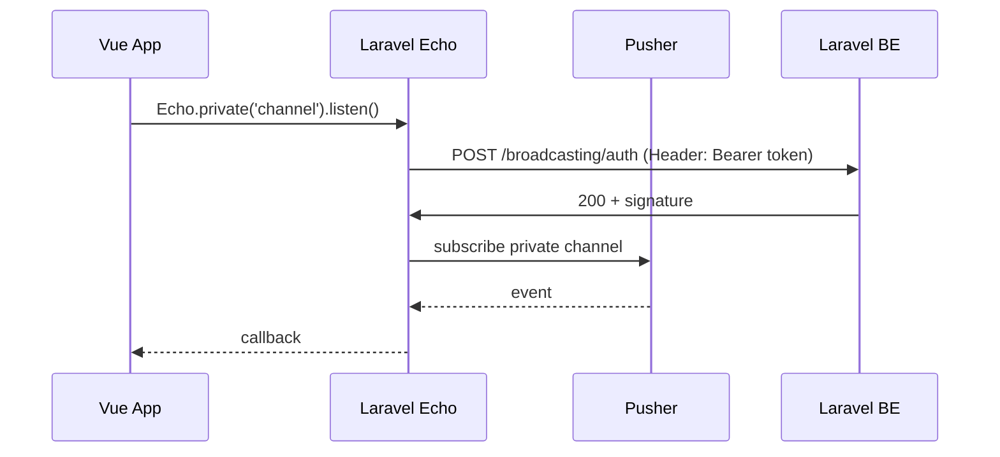

# Setup Pusher JS + Laravel Echo dengan token dari localStorage

## Konteks

- **Token**: Disimpan di `localStorage` dengan key `userData` (JSON). Akses via [`src/plugins/local.js`](src/plugins/local.js) — `getLocal().token`.
- **Plugin**: Aplikasi memuat plugin dari [`src/plugins/*.js`](src/@core/utils/plugins.js) via `registerPlugins`; plugin harus export default `function(app)` dan boleh memanggil `app.use(...)`.

## Arsitektur singkat

- Untuk **public channel**: cukup `key`, `cluster`, tidak perlu auth.
- Untuk **private/presence**: Echo memanggil `authEndpoint` (Laravel `/broadcasting/auth`) dengan header `Authorization: Bearer <token>`; token diambil dari localStorage saat inisialisasi (atau saat subscribe, lihat opsi di bawah).

---

## 1. Dependency

Tambahkan di [`package.json`](package.json) (dependencies):

- **pusher-js** — client Pusher untuk browser
- **laravel-echo** — wrapper yang pakai Pusher dan handle auth ke Laravel

Jalankan: `npm install pusher-js laravel-echo`

---

## 2. Environment

Tambahkan di `.env` (dan dokumentasi di `.env.example`):

| Variabel | Contoh | Keterangan |
|----------|--------|------------|
| `VITE_PUSHER_APP_KEY` | dari dashboard Pusher / `.env` Laravel | App key |
| `VITE_PUSHER_APP_CLUSTER` | `ap1` / `mt1` | Cluster (atau region) |
| `VITE_PUSHER_APP_HOST` | (kosong) | Opsional; untuk self-hosted Pusher server |
| `VITE_PUSHER_APP_USE_TLS` | `true` | Opsional; default true |
| `VITE_BROADCAST_AUTH_ENDPOINT` | `https://back.ordivapos.com/broadcasting/auth` | URL endpoint auth Laravel (harus sama dengan base URL BE) |

Nilai ini harus selaras dengan `config/broadcasting.php` dan `.env` di backend Laravel (PUSHER_APP_*).

---

## 3. Plugin Echo (frontend)

Buat file baru **`src/plugins/echo.js`** (atau `src/plugins/pusher/index.js` jika ingin satu folder).

**Isi plugin:**

- Import: `Echo` dari `laravel-echo`, `Pusher` dari `pusher-js`, `getLocal` dari `@/plugins/local`.
- Pasang Pusher ke window (requirement Laravel Echo): `window.Pusher = Pusher`.
- Ambil token: `const token = getLocal()?.token` (dari localStorage).
- Buat instance Echo dengan:
  - `broadcaster: 'pusher'`
  - `key`: `import.meta.env.VITE_PUSHER_APP_KEY`
  - `cluster`: `import.meta.env.VITE_PUSHER_APP_CLUSTER`
  - `forceTLS`: true (atau dari env)
  - `authEndpoint`: `import.meta.env.VITE_BROADCAST_AUTH_ENDPOINT`
  - **`auth: { headers: { Authorization: token ? \`Bearer ${token}\` : '' } }`** — inilah yang mengirim token ke BE Laravel saat subscribe private/presence.
- Export instance Echo (mis. `export const echo = echoInstance`).
- Export default plugin: `export default function(app) { app.config.globalProperties.$echo = echoInstance }` agar bisa pakai `this.$echo` di komponen.

**Penting:** Token dibaca sekali saat plugin di-load. Jika user login setelah halaman load, token lama (atau kosong) yang terpakai. Opsi:

- **A)** Cukup baca token sekali di init (reload setelah login agar Echo di-init ulang dengan token baru).
- **B)** Lazy init: buat instance Echo hanya saat pertama kali dipakai (mis. saat pertama `Echo.private()`), dan saat itu panggil `getLocal()?.token` lagi sehingga token selalu diambil dari localStorage terbaru.

Rencana implementasi: **Opsi B (lazy init)** — saat pertama subscribe private/presence, baca ulang `getLocal()?.token` dan set ke `auth.headers.Authorization` (atau buat instance Echo saat itu dengan token terbaru). Ini memastikan token yang dikirim ke BE selalu dari localStorage terbaru.

---

## 4. Penggunaan di komponen

- Import: `import { echo } from '@/plugins/echo'` (atau pakai `this.$echo` jika di-set di globalProperties).
- Public channel: `echo.channel('nama-channel').listen('EventName', e => { ... })`
- Private channel: `echo.private('nama-channel').listen('EventName', e => { ... })` — request ke `authEndpoint` akan membawa header Bearer token dari localStorage.
- Leave: `echo.leave('nama-channel')` / `echo.leaveChannel('nama-channel')` saat komponen unmount.

Tidak perlu mengubah router atau store hanya untuk “setup”; cukup pasang plugin dan panggil `echo` di halaman yang butuh realtime.

---

## 5. Backend Laravel (ringkas)

Agar token dari localStorage dipakai untuk auth broadcasting:

- **CORS**: Endpoint `POST .../broadcasting/auth` harus mengizinkan request dari origin frontend dan header `Authorization`.
- **Guard**: Route `broadcasting/auth` harus memakai guard yang menerima **Bearer token** (biasanya `sanctum` atau guard API). Di `config/auth.php` pastikan guard API memakai driver yang memvalidasi token (mis. `sanctum`).
- **BroadcastServiceProvider**: Di `routes/channels.php` definisikan channel (contoh: `Broadcast::channel('order.{id}', ...)`) dan pastikan user di-authenticate via `$request->user()` (dari token).
- **.env Laravel**: `BROADCAST_DRIVER=pusher`, `PUSHER_APP_*` sama dengan yang dipakai di frontend (key, cluster, dll.).

Tidak ada perubahan kode di repo Vue untuk bagian ini; yang penting konfigurasi dan endpoint auth siap menerima Bearer token.

---

## 6. Checklist implementasi

| Langkah | Tugas |
|--------|--------|
| 1 | Tambah `pusher-js` dan `laravel-echo` di `package.json`, jalankan `npm install` |
| 2 | Tambah variabel env `VITE_PUSHER_APP_*` dan `VITE_BROADCAST_AUTH_ENDPOINT` di `.env` dan `.env.example` |
| 3 | Buat `src/plugins/echo.js`: set `window.Pusher`, inisialisasi Echo (dengan lazy init + baca token dari `getLocal()?.token`), set `auth.headers.Authorization` ke `Bearer ${token}`, export instance dan default plugin |
| 4 | (Opsional) Di halaman yang butuh realtime, import `echo` dan subscribe/unsubscribe channel; pastikan BE sudah siap terima token di `/broadcasting/auth` |

Dengan ini, Pusher JS terhubung ke BE Laravel dan token yang dikirim ke backend diambil dari localStorage (lewat plugin Echo).
